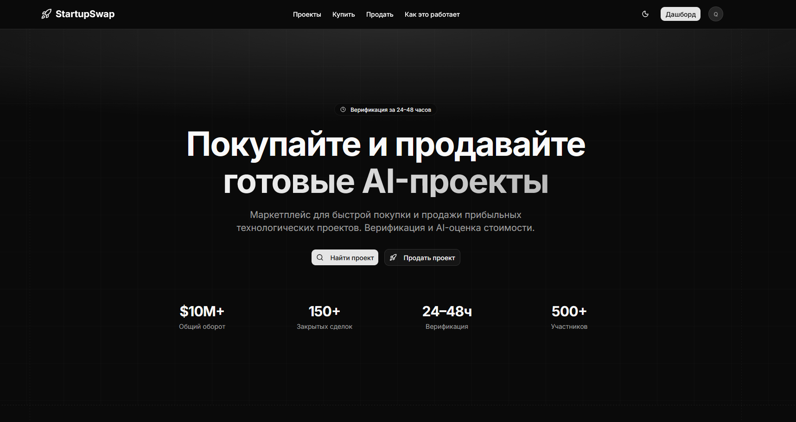
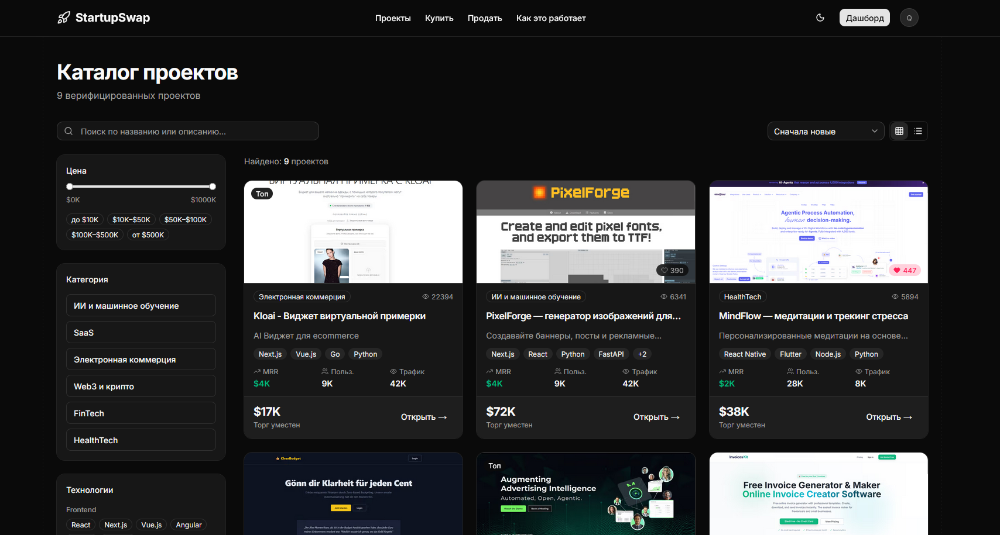
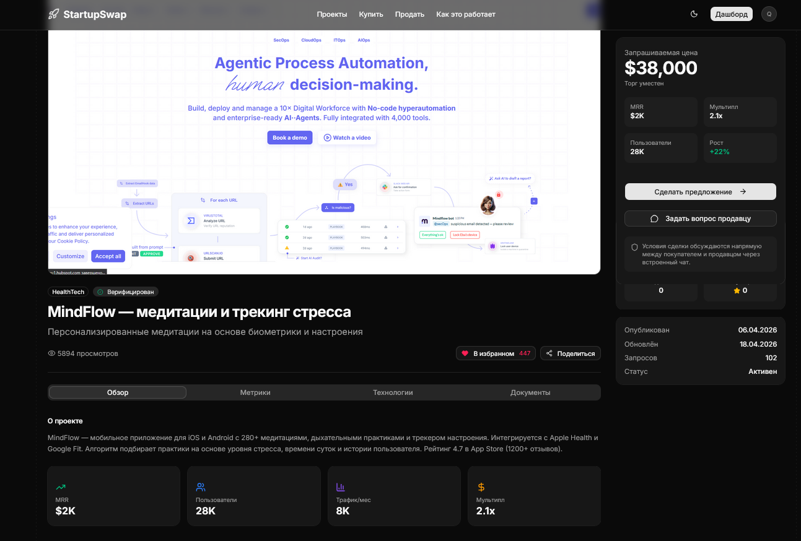

# StartupSwap

StartupSwap — маркетплейс для покупки и продажи технологических стартапов и готовых онлайн-бизнесов.

## О проекте

Платформа создана для предпринимателей, которые хотят продать действующий проект, и для покупателей, ищущих готовый бизнес с подтверждёнными метриками. StartupSwap сокращает путь от намерения до закрытой сделки за счёт структурированного процесса верификации, встроенной системы офферов и поэтапной передачи проекта.

## Для продавцов

Продавец размещает листинг с описанием проекта, финансовыми метриками, технологическим стеком и медиаматериалами. После прохождения верификации листинг становится доступен квалифицированным покупателям. Платформа обеспечивает прозрачность на каждом этапе: от первого контакта до передачи активов.

## Для покупателей

Покупатель получает доступ к каталогу верифицированных проектов с фильтрацией по категории, цене, выручке и технологиям. Встроенный чат позволяет вести переговоры напрямую с продавцом. Система офферов фиксирует условия сделки, платформа отслеживает поэтапную передачу проекта.

## Процесс сделки

1. Продавец публикует листинг и проходит верификацию.
2. Покупатель изучает проект, задаёт вопросы через встроенный чат.
3. Покупатель направляет оффер с предложением цены и условиями.
4. Стороны согласовывают условия напрямую.
5. Платформа фиксирует этапы передачи проекта.
6. Сделка закрывается после выполнения всех этапов.

## Категории проектов

Платформа охватывает следующие направления: искусственный интеллект и машинное обучение, SaaS-продукты, электронная коммерция, Web3 и криптовалюты, финансовые технологии, медицинские технологии.
